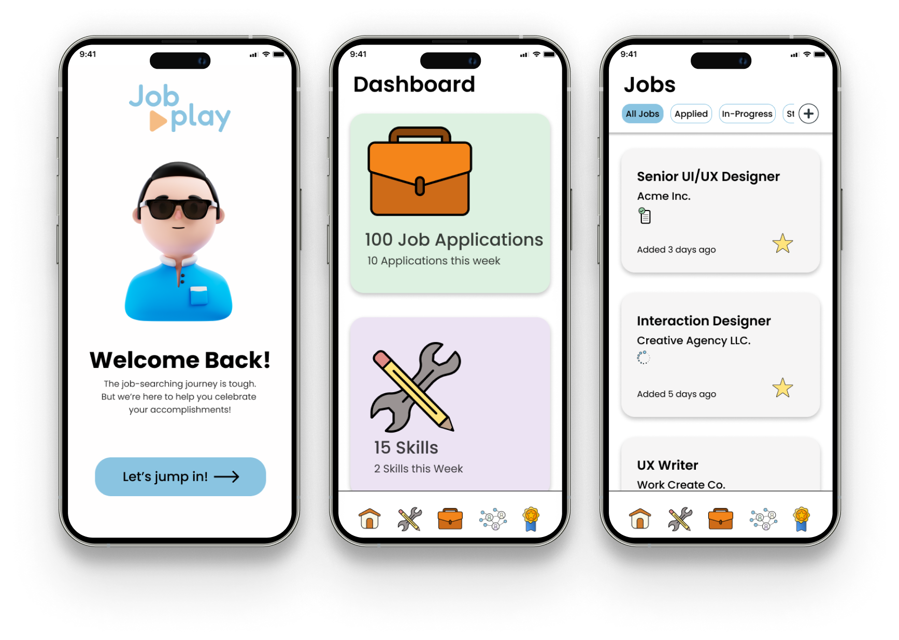

---
# JobPlay

JobPlay is an innovative and engaging web application that revolutionizes the way users approach their job search, skill development, and professional networking. Designed with mobile responsiveness in mind, JobPlay offers a seamless experience across devices. By incorporating gamification elements, JobPlay turns job hunting and career advancement into a fun, rewarding, and interactive experience. Users can track job opportunities, build on their skillsets, and expand their professional networks, all while earning points and unlocking badges to mark their progress.

---

📲 [App Demo](https://job-play.netlify.app/)
---
⬅️ [Back-End Repo](https://github.com/plam1216/jobplay-backend)

# Meet the Team

### Software Engineers ⤵️
[Danny Yu](https://github.com/DannyYu728)

[Peter Lam](https://github.com/plam1216)

[Oscar Nunez](https://github.com/oscarnunez1)

[Patrick Mazara](https://github.com/zaragotcode)

[Luis Sanchez](https://github.com/luisdaniel0)

---

### UX Designers ⤵️

[Anna Tran](https://www.linkedin.com/in/annaatrann/)

[Dasha Tcherkassova](https://www.linkedin.com/in/dasha-tcherkassova/)

[Mike Snider](https://www.linkedin.com/in/mikesnider8/)

### Technologies used by the design team:

### Technologies and libraries used by the software engineering team:

---
# Ice Box 🧊
- [ ] Social Media Integration
- [ ] Job Recommendations
- [ ] Skill Challenges and Peer Collaboration
- [ ] Calendar Integration
- [ ] Consultation System
- [ ] Customizable Leaderboards
- [ ] More Rewards, Badges
